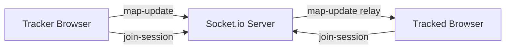

# SyncSphere

Real-time dual-map synchronization for live location coordination.

SyncSphere lets two users join a shared session and synchronize map movement in real time:
- Tracker: broadcasts map pan/zoom updates.
- Tracked: receives updates and mirrors the tracker view.

The project is split into:
- Frontend app: `syncsphere/` (Next.js + Leaflet)
- Backend server: `server/` (Express + Socket.io)

## Why This Project

Most map-sharing flows are link-based, delayed, or heavy on setup. SyncSphere focuses on:
- Fast session join with a short session ID
- Low-latency live map synchronization
- Simple browser-first UX (no auth required)

## Core Features

- Real-time map sync using Socket.io rooms
- Session-based collaboration (join by session ID)
- Role mode selection: Tracker or Tracked
- Auto-reconnect and connection status states
- Geolocation centering for tracker
- Live HUD with coordinates, zoom, role, and connection status
- Clean glassmorphism UI with mobile-friendly layout

## Tech Stack

### Frontend (`syncsphere/`)
- Next.js 16 (App Router, TypeScript)
- React 19
- Tailwind CSS v4
- Leaflet + react-leaflet
- socket.io-client
- uuid

### Backend (`server/`)
- Node.js + Express
- Socket.io
- CORS

## Repository Structure

```text
Syncsphere/
	README.md                # You are here
	server/
		index.js               # Express + Socket.io server
		package.json
	syncsphere/
		app/                   # Next.js app router
		components/            # SessionSetup, MapComponent, HUD
		lib/socket.ts          # Socket singleton client factory
		package.json
		next.config.ts
		.env.example
```

## Architecture Overview



Event model:
- Client emits `join-session` with a session ID
- Tracker emits `map-update` payloads `{ sessionId, lat, lng, zoom }`
- Server relays updates to all other sockets in that session room

## Local Development Setup

### 1) Clone and install dependencies

```bash
git clone <your-repo-url>
cd Syncsphere

cd syncsphere
npm install

cd ../server
npm install
```

### 2) Configure environment

Create frontend env file:

`syncsphere/.env.local`

```env
NEXT_PUBLIC_SOCKET_URL=http://localhost:4000
```

Optional backend env values:

```env
PORT=4000
CLIENT_ORIGIN=http://localhost:3000
```

### 3) Run backend and frontend

Terminal 1 (backend):

```bash
cd server
npm run dev
```

Terminal 2 (frontend):

```bash
cd syncsphere
npm run dev
```

Open `http://localhost:3000`.

## How to Use

1. Open the app in one browser tab/device and choose role `Tracker`.
2. Create or enter a session ID and join.
3. Open a second tab/device, choose role `Tracked`, enter the same session ID, and join.
4. Move the map on tracker side and watch the tracked side mirror updates.

## Scripts

### Frontend (`syncsphere/package.json`)
- `npm run dev`: run Next.js dev server with webpack
- `npm run build`: production build (forced webpack for compatibility)
- `npm run start`: start production server
- `npm run lint`: run ESLint

### Backend (`server/package.json`)
- `npm run dev`: run nodemon server
- `npm start`: run Node server

## Deployment Guide

Use two deployments:
- Frontend on Vercel (root directory: `syncsphere`)
- Backend on Render (root directory: `server`)

### Backend (Render)
- Build command: `npm install`
- Start command: `node index.js`
- Env:
	- `PORT=4000` (optional)
	- `CLIENT_ORIGIN=https://<your-vercel-domain>`

### Frontend (Vercel)
- Root directory: `syncsphere`
- Build command: default (`npm run build`)
- Env:
	- `NEXT_PUBLIC_SOCKET_URL=https://<your-render-domain>`

After deploying both:
1. Set Render `CLIENT_ORIGIN` to your Vercel domain
2. Redeploy backend
3. Verify end-to-end socket connection

## Troubleshooting

- Build fails with Turbopack + webpack config conflict:
	- Keep frontend scripts using `--webpack` for `dev` and `build`.
- Frontend connects locally but not in production:
	- Check `NEXT_PUBLIC_SOCKET_URL` and Render URL
	- Ensure backend CORS `CLIENT_ORIGIN` includes the Vercel domain
- Map not centering on user location:
	- Browser location permission must be granted
- Delayed first socket connect on Render free tier:
	- Cold starts are expected; app should reconnect automatically

## Security Notes

- Session IDs are not authentication tokens
- This is room-based coordination, not end-to-end encrypted messaging
- Validate and sanitize any future custom payloads if you expand features

## Future Improvements

- Presence indicators (peer joined/left)
- Session expiration and cleanup policies
- Optional auth + access control
- Persisted room metadata (Redis/DB)
- Multi-user spectator support

## License

Add your preferred license here (MIT recommended for open-source use).